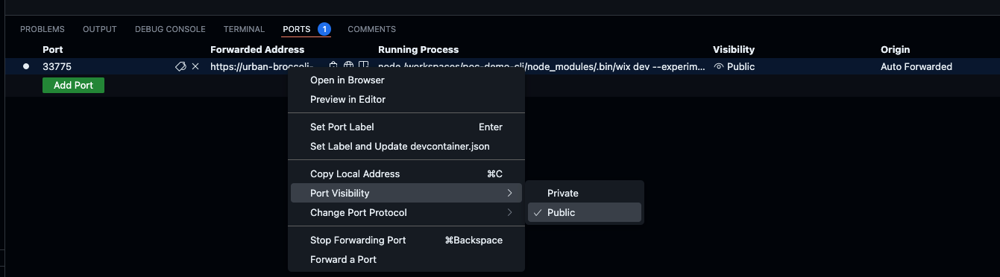

# Proxy to Codespace's reverse proxy
This small utility creates a proxy which supports Web Sockets from localhost to a Codespace proxy server.
This is useful when running in a Codespace a process which is starting a server which assumes it is running on localhost.

By using this proxy, one can open `http://localhost:<port>` and access a process running in a Codespace

Usage:
1. One time initialization
   - Create a folder - `keys` - 'mkdir keys && cd keys'
   - Create a key using openssl (install globally if you don't use it already): 
     `openssl req -x509 -newkey rsa:4096 -keyout key.pem -out cert.pem -days 365` when prompted provide a password
   - Create a self signed certificate - `openssl pkcs12 -export -out certificate.p12 -inkey key.pem -in cert.pem -password pass:<YOUR PASS>`, replace `<YOUR PASS>` with the password you defined in the previous step 
     When required provide a password
   - Add the password you defined to `.env.local` by running `echo "CERT_PASS=<YOUR CERT_PASS>" > .env.local` - replace `<YOUR CERT_PASS>` with the password you defined in the previous step.
2. Install deps `npm i`
3. Check the name of the codespace you wish to access and the port, don't forget to define its visibility as Public in the Codespace:

